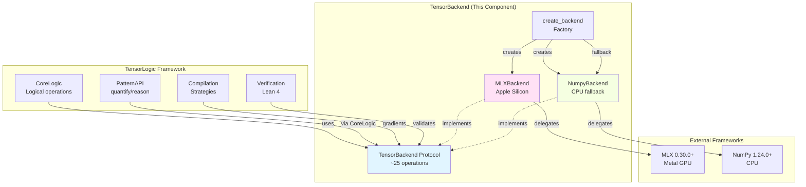
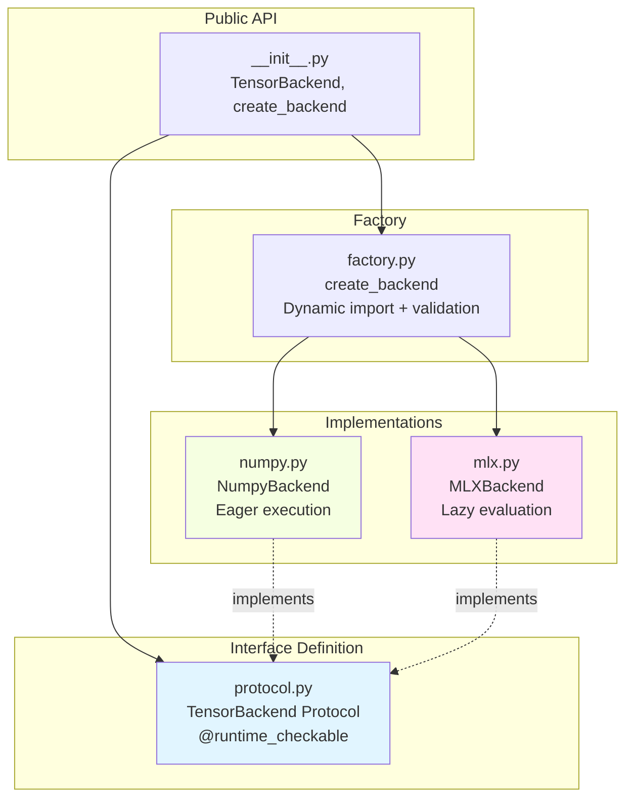

# TensorBackend - Technical Breakdown

**Created:** 2025-12-08
**Sources:** [spec](../specs/backend/spec.md) | [plan](../specs/backend/plan.md) | [tasks](../specs/backend/tasks.md)

---

## Quick Reference

```yaml
complexity: Medium
risk_level: Low
team_size: 1-2 engineers
duration: 2 weeks (10 working days)
dependencies:
  downstream:
    - CoreLogic (tensor-to-logic operations)
    - PatternAPI (via CoreLogic)
    - Compilation (gradient computation)
    - Verification (operation validation)
  external:
    - MLX ≥0.30.0 (Apple Silicon backend)
    - NumPy ≥1.24.0 (fallback backend)
    - Python ≥3.12 (modern type hints)
```

## Component Overview

**Purpose:** Protocol-based tensor backend abstraction enabling framework-portable tensor operations with zero vendor lock-in.

**Key Capabilities:**
- Structural typing via TensorBackend Protocol (~25 operations)
- MLX backend for Apple Silicon (lazy evaluation, unified memory, Metal GPU)
- NumPy backend for CPU fallback (eager evaluation, reference implementation)
- Factory pattern with graceful degradation (MLX → NumPy)
- Zero-overhead abstraction (<1% performance penalty)

**Success Metrics:**
- Protocol compliance: 100% (all backends pass isinstance())
- Performance overhead: <1% vs direct MLX calls
- Test coverage: ≥90%
- Type safety: mypy strict 0 errors
- Cross-validation: MLX == NumPy within 1e-6 tolerance

## System Context



**Integration Points:**

1. **Downstream (Consumers of this component):**
   - **CoreLogic**: Uses TensorBackend for all tensor-to-logic operations (AND, OR, EXISTS, FORALL)
   - **PatternAPI**: Indirectly via CoreLogic for pattern execution
   - **Compilation**: Uses backend.grad() for differentiable strategies
   - **Verification**: Validates backend operations match Lean 4 theorems

2. **Upstream (Dependencies):**
   - **Python 3.12+**: Modern type hints (`|` unions, built-in generics)
   - **MLX ≥0.30.0**: Optional, for Apple Silicon backend
   - **NumPy ≥1.24.0**: Required, for CPU fallback backend

3. **Async/Events:** None - purely computational, no I/O

## Architecture Design

### Component Structure



### Key Modules

**Module 1: protocol.py**
- **Responsibility:** Define TensorBackend Protocol with ~25 operation signatures
- **Dependencies:** Python typing module only
- **Complexity:** Low (pure interface definition)
- **Key Operations:**
  - Core: `einsum()`, `grad()`, `eval()`, `step()`
  - Arithmetic: `add()`, `multiply()`, `divide()`, `subtract()`, `power()`
  - Reductions: `sum()`, `prod()`, `maximum()`, `minimum()`, `mean()`
  - Activations: `sigmoid()`, `softmax()`, `relu()`
  - Array ops: `reshape()`, `transpose()`, `concatenate()`, `stack()`, `split()`
  - Utilities: `zeros()`, `ones()`, `arange()`, `where()`

**Module 2: numpy.py**
- **Responsibility:** Reference implementation using NumPy (eager evaluation)
- **Dependencies:** protocol.py, numpy>=1.24.0
- **Complexity:** Low (thin wrapper around NumPy)
- **Special Handling:**
  - `step()`: Implemented via `np.heaviside(x, 0.5)`
  - `eval()`: No-op (NumPy is eager)
  - `grad()`: Numerical differentiation fallback

**Module 3: mlx.py**
- **Responsibility:** Primary backend for Apple Silicon (lazy evaluation)
- **Dependencies:** protocol.py, mlx>=0.30.0
- **Complexity:** Medium (lazy evaluation edge cases)
- **Special Handling:**
  - `step()`: Workaround via `mx.where(x > 0, 1.0, 0.0)`
  - `eval()`: Calls `mx.eval(*arrays)` to force computation
  - `grad()`: Delegates to `mx.grad()` and `mx.value_and_grad()`

**Module 4: factory.py**
- **Responsibility:** Create backend instances by name with validation
- **Dependencies:** All above modules
- **Complexity:** Low (dependency injection pattern)
- **Features:**
  - Dynamic import (avoid import-time failures)
  - Protocol validation via `isinstance(backend, TensorBackend)`
  - Graceful fallback: MLX unavailable → NumPy
  - Enhanced error messages with installation hints

## Interface Contracts

### TensorBackend Protocol

```python
from __future__ import annotations
from typing import Any, Protocol, runtime_checkable
from collections.abc import Callable

@runtime_checkable
class TensorBackend(Protocol):
    """Protocol defining tensor backend interface.

    All backends must implement these ~25 operations using their
    native framework. Protocol is runtime-checkable for validation.
    """

    # Core operations
    def einsum(self, pattern: str, *tensors: Any) -> Any:
        """Execute Einstein summation.

        Args:
            pattern: Einstein notation pattern (e.g., 'ij,jk->ik')
            *tensors: Input tensors

        Returns:
            Result tensor following pattern
        """
        ...

    def grad(self, fn: Callable[..., Any]) -> Callable[..., Any]:
        """Create gradient function.

        Args:
            fn: Function to differentiate

        Returns:
            Gradient function
        """
        ...

    def eval(self, *arrays: Any) -> None:
        """Force evaluation of lazy tensors.

        Critical for MLX lazy evaluation. No-op for eager backends.

        Args:
            *arrays: Arrays to evaluate
        """
        ...

    def step(self, x: Any) -> Any:
        """Heaviside step function for boolean logic.

        Returns 0 for x <= 0, 1 for x > 0.

        Args:
            x: Input tensor

        Returns:
            Step function result (0/1 values)
        """
        ...

    # Arithmetic operations (add, multiply, divide, subtract, power)
    # Reduction operations (sum, prod, maximum, minimum, mean)
    # Activation operations (sigmoid, softmax, relu)
    # Array operations (reshape, transpose, concatenate, stack, split)
    # Utility operations (zeros, ones, arange, where)
    # ... (~21 more methods)
```

### Factory Function

```python
def create_backend(name: str = "mlx") -> TensorBackend:
    """Create tensor backend by name.

    Args:
        name: Backend name ("mlx" or "numpy")

    Returns:
        TensorBackend instance

    Raises:
        ValueError: If backend unknown or validation fails
        ImportError: If backend dependencies missing (wrapped)

    Examples:
        >>> backend = create_backend("mlx")
        >>> backend = create_backend("numpy")
    """
    try:
        if name == "mlx":
            from .mlx import MLXBackend
            backend = MLXBackend()
        elif name == "numpy":
            from .numpy import NumpyBackend
            backend = NumpyBackend()
        else:
            raise ValueError(f"Unknown backend: {name}. Use 'mlx' or 'numpy'.")

        # Runtime validation
        if not isinstance(backend, TensorBackend):
            raise TypeError(f"{type(backend)} doesn't implement TensorBackend")

        return backend

    except ImportError as e:
        if name == "mlx":
            logger.warning(f"MLX not available: {e}. Falling back to NumPy.")
            return create_backend("numpy")
        raise ValueError(
            f"{name} backend not available. Install with: uv add {name}"
        ) from e
```

### Data Flow Example

```python
# 1. Create backend
backend = create_backend("mlx")

# 2. Define tensors
A = [[1.0, 2.0], [3.0, 4.0]]
B = [[5.0, 6.0], [7.0, 8.0]]

# 3. Execute operation (MLX builds lazy graph)
result = backend.einsum("ij,jk->ik", A, B)

# 4. Force evaluation (critical for MLX)
backend.eval(result)

# 5. Result: [[19.0, 22.0], [43.0, 50.0]]
```

## Implementation Details

### Technology Stack

**Runtime:** Python ≥3.12
**Primary Backend:** MLX ≥0.30.0 (Apple ML Research, 22,800+ stars)
**Fallback Backend:** NumPy ≥1.24.0
**Type Checking:** mypy ≥1.0 (strict mode)
**Testing:** pytest ≥7.0, hypothesis ≥6.0
**Linting:** ruff ≥0.1.0

**Rationale:**
- **MLX primary**: Unified memory, Metal GPU, lazy evaluation, CUDA backend (March 2025)
- **Protocol over ABC**: Structural typing, no inheritance overhead ([PEP 544](https://peps.python.org/pep-0544/))
- **NumPy fallback**: Simple, bit-accurate reference for cross-validation
- **Python 3.12+**: Built-in generics (`list[int]`), union syntax (`int | None`)

### Design Patterns

1. **Protocol Pattern** ([Typing Protocols](https://typing.python.org/en/latest/reference/protocols.html))
   - Structural subtyping via `@runtime_checkable`
   - No inheritance hierarchy
   - Duck typing with type safety

2. **Factory Pattern**
   - Dependency injection point
   - Dynamic import to avoid import-time failures
   - Graceful degradation strategy

3. **Adapter Pattern**
   - Wraps native frameworks (MLX, NumPy)
   - Unified interface across different evaluation strategies

### Configuration

No runtime configuration needed. Backend selection at creation time:

```python
# Explicit backend selection
backend = create_backend("mlx")      # Apple Silicon
backend = create_backend("numpy")    # CPU fallback

# Default: MLX with fallback to NumPy
backend = create_backend()
```

## Testing Strategy

### Unit Tests (Target: ≥90% coverage)

**Critical Paths:**
- Each Protocol operation tested independently
- Backend-specific behavior (lazy vs eager)
- Edge cases: empty tensors, scalars, large batches
- Error handling: invalid shapes, type mismatches

**Tools:** pytest

**Example:**
```python
def test_numpy_einsum():
    backend = create_backend("numpy")
    A = [[1.0, 2.0], [3.0, 4.0]]
    B = [[5.0, 6.0], [7.0, 8.0]]
    result = backend.einsum("ij,jk->ik", A, B)
    expected = [[19.0, 22.0], [43.0, 50.0]]
    assert np.allclose(result, expected)
```

### Property-Based Tests (hypothesis)

**Mathematical Properties:**
- Commutativity: `a * b == b * a`
- Associativity: `(a * b) * c == a * (b * c)`
- Distributivity: `a * (b + c) == a * b + a * c`
- Identity: `a * 1 == a`, `a + 0 == a`

**Tools:** hypothesis

**Example:**
```python
from hypothesis import given, strategies as st

@given(
    a=st.lists(st.floats(), min_size=1, max_size=100),
    b=st.lists(st.floats(), min_size=1, max_size=100),
)
def test_multiply_commutative(a, b):
    backend = create_backend("numpy")
    min_len = min(len(a), len(b))
    result_ab = backend.multiply(a[:min_len], b[:min_len])
    result_ba = backend.multiply(b[:min_len], a[:min_len])
    assert np.allclose(result_ab, result_ba)
```

### Cross-Backend Validation

**Scenarios:**
1. MLX results match NumPy within FP32 tolerance (1e-6)
2. Same inputs produce same outputs across backends
3. Parametrized tests across both backends

**Example:**
```python
@pytest.mark.parametrize("backend_name", ["mlx", "numpy"])
def test_einsum_cross_backend(backend_name):
    backend = create_backend(backend_name)
    A = [[1.0, 2.0], [3.0, 4.0]]
    B = [[5.0, 6.0], [7.0, 8.0]]
    result = backend.einsum("ij,jk->ik", A, B)
    backend.eval(result)  # No-op for NumPy, critical for MLX
    expected = [[19.0, 22.0], [43.0, 50.0]]
    assert np.allclose(result, expected)
```

### Performance Tests

**Load Scenarios:**
- Overhead <1% vs direct MLX calls
- Memory profiling (unified memory utilization)
- Batch sizes: 4, 8, 16, 32 on M1 Pro

**Tools:** pytest-benchmark, memory_profiler

**Example:**
```python
def test_mlx_overhead(benchmark):
    backend = create_backend("mlx")
    A = mx.random.normal((1000, 1000))
    B = mx.random.normal((1000, 1000))

    def backend_call():
        result = backend.einsum("ij,jk->ik", A, B)
        backend.eval(result)
        return result

    result = benchmark(backend_call)
    # Assert <1% overhead vs direct mx.einsum()
```

### Integration Tests

**Scenarios:**
1. Factory creates backends correctly
2. Protocol validation via isinstance()
3. Graceful fallback mechanism (MLX → NumPy)
4. CoreLogic integration (if available)

**Example:**
```python
def test_factory_fallback(monkeypatch):
    # Simulate MLX unavailable
    monkeypatch.setattr("sys.modules", {"mlx": None})
    backend = create_backend("mlx")
    # Should fallback to NumPy
    assert isinstance(backend, NumpyBackend)
```

## Operational Concerns

### Infrastructure

Since this is a library (not a service), infrastructure concerns are different:

```yaml
Development:
  - Python 3.12+ runtime
  - Virtual environment: uv venv
  - Package manager: uv

Testing:
  - CI/CD: GitHub Actions
  - Test runners: pytest
  - Coverage: pytest-cov (≥90%)
  - Type checking: mypy --strict
  - Linting: ruff check

Deployment:
  - Package format: Wheel (.whl)
  - Distribution: PyPI
  - Versioning: Semantic (0.1.0 → 1.0.0)
```

### Monitoring

**Library Monitoring (CI/CD):**
- Type checking: mypy strict mode (0 errors)
- Test suite: All tests passing
- Coverage: ≥90% threshold
- Performance: Regression tests (<1% overhead)
- Cross-validation: MLX == NumPy within tolerance

**No Runtime Monitoring** (library, not service)

### Security

**Dependency Scanning:**
- Tool: pip-audit, safety
- Frequency: On every commit (CI)
- Action: Block PR if vulnerabilities found

**No Other Security Concerns:**
- No network access
- No file I/O (except code)
- No user input validation needed
- Pure computational library

### Scaling Strategy

**Not Applicable** - This is a library consumed by applications. Scaling happens at the application layer (CoreLogic, PatternAPI).

## Risk Analysis

### Technical Risks

| Risk | Impact | Likelihood | Mitigation |
|------|--------|------------|------------|
| MLX lazy evaluation edge cases | High | Medium | Document clearly, add assertions in CoreLogic, comprehensive tests |
| step() workaround produces incorrect values | Medium | Low | Cross-validate against np.heaviside, property tests |
| Performance overhead >1% | Medium | Low | Benchmark early, profile before optimizing, escape hatch to native API |
| Protocol validation failure | High | Low | Runtime isinstance() checks in factory, comprehensive unit tests |

### Dependency Risks

| Dependency | Risk | Mitigation |
|------------|------|------------|
| MLX API changes | MLX evolves, breaks compatibility | Pin MLX version (≥0.30.0, <0.31.0), test against multiple versions |
| Apple Silicon availability | Development on non-Apple hardware | NumPy fallback fully functional for CPU-only development |
| NumPy API changes | NumPy deprecations | Pin NumPy version (≥1.24.0), monitor deprecation warnings |

## Development Workflow

### Local Setup

```bash
# Clone repository
git clone https://github.com/Mathews-Tom/TensorLogic.git
cd TensorLogic

# Create virtual environment
uv venv
source .venv/bin/activate  # macOS/Linux
# .venv\Scripts\activate  # Windows

# Install dependencies
uv add --dev mlx numpy pytest hypothesis mypy ruff pytest-cov
```

### Code Quality

**Linting:** ruff (fast Python linter)
```bash
uv run ruff check src/tensorlogic/backends
```

**Type Safety:** mypy strict mode
```bash
uv run mypy --strict src/tensorlogic/backends
```

**Testing:** pytest with coverage
```bash
uv run pytest tests/test_backends -v
uv run pytest --cov=tensorlogic.backends --cov-report=term-missing
```

**Pre-commit:** (Optional) Configure hooks
```yaml
# .pre-commit-config.yaml
repos:
  - repo: https://github.com/astral-sh/ruff-pre-commit
    rev: v0.1.0
    hooks:
      - id: ruff
      - id: ruff-format
```

### Deployment Pipeline

```yaml
Stages:
  1. Build: Package wheel (python -m build)
  2. Test: Unit, property-based, cross-validation tests
  3. Security: Dependency scan (pip-audit)
  4. Type Check: mypy --strict (0 errors)
  5. Coverage: pytest-cov (≥90%)
  6. Deploy PyPI: Manual approval, twine upload
```

**CI Configuration (GitHub Actions):**
```yaml
name: Backend Tests
on: [push, pull_request]
jobs:
  test:
    runs-on: macos-latest  # For MLX testing
    steps:
      - uses: actions/checkout@v4
      - uses: actions/setup-python@v5
        with:
          python-version: '3.12'
      - run: pip install uv
      - run: uv add --dev mlx numpy pytest hypothesis mypy ruff
      - run: uv run pytest tests/test_backends --cov=tensorlogic.backends
      - run: uv run mypy --strict src/tensorlogic/backends
```

## Implementation Checklist

**Phase 1: Foundation (Sprint 1, Days 1-5, 13 SP)**
- [ ] BACKEND-002: Define TensorBackend Protocol (5 SP)
  - [ ] Create protocol.py with ~25 operation signatures
  - [ ] Add @runtime_checkable decorator
  - [ ] Write Google-style docstrings
  - [ ] Create py.typed marker file
  - [ ] Pass mypy --strict

- [ ] BACKEND-003: Implement NumPy Backend (5 SP)
  - [ ] Create numpy.py with NumpyBackend class
  - [ ] Implement all Protocol methods
  - [ ] Handle step() via np.heaviside()
  - [ ] Implement eval() as no-op
  - [ ] Write unit tests for all operations
  - [ ] Achieve ≥90% coverage

- [ ] BACKEND-004: Factory Pattern & Validation (3 SP)
  - [ ] Create factory.py with create_backend()
  - [ ] Add Protocol validation via isinstance()
  - [ ] Implement graceful fallback (MLX → NumPy)
  - [ ] Create __init__.py with exports
  - [ ] Write integration tests

**Phase 2: MLX Integration (Sprint 2, Days 6-10, 21 SP)**
- [ ] BACKEND-005: Implement MLX Backend (8 SP)
  - [ ] Create mlx.py with MLXBackend class
  - [ ] Map Protocol methods to MLX operations
  - [ ] Handle step() workaround (mx.where)
  - [ ] Implement eval() calling mx.eval()
  - [ ] Write MLX-specific tests (lazy evaluation)
  - [ ] Achieve ≥90% coverage

- [ ] BACKEND-006: Cross-Backend Validation (5 SP)
  - [ ] Create test_cross_validation.py
  - [ ] Property-based tests (commutativity, associativity)
  - [ ] Cross-validation: MLX == NumPy within 1e-6
  - [ ] Parametrize tests across backends
  - [ ] hypothesis generative tests

- [ ] BACKEND-007: Performance Validation & Optimization (5 SP)
  - [ ] Create performance benchmark suite
  - [ ] Measure overhead vs direct MLX (<1%)
  - [ ] Profile memory (unified memory)
  - [ ] Test batch sizes 4-32
  - [ ] Add performance regression tests to CI

- [ ] BACKEND-008: Production Readiness (3 SP)
  - [ ] Verify ≥90% coverage across all files
  - [ ] Pass mypy --strict (0 errors)
  - [ ] Write README.md with usage examples
  - [ ] Generate API documentation
  - [ ] Integration smoke tests with CoreLogic

## References

**Internal Documentation:**
- [Specification](../specs/backend/spec.md) - Functional requirements, acceptance criteria
- [Implementation Plan](../specs/backend/plan.md) - PRP-format blueprint with context
- [Task Breakdown](../specs/backend/tasks.md) - SMART tasks, story points, sprint planning
- [GitHub Epic #1](https://github.com/Mathews-Tom/TensorLogic/issues/1) - Epic tracking

**External Research:**
- [PEP 544: Protocols](https://peps.python.org/pep-0544/) - Structural subtyping specification
- [Python Protocols Guide](https://typing.python.org/en/latest/reference/protocols.html) - Official typing documentation
- [MLX Framework](https://github.com/ml-explore/mlx) - Apple's ML framework for Apple Silicon
- [MLX Documentation](https://ml-explore.github.io/mlx/) - Lazy evaluation, unified memory architecture
- [einops Philosophy](https://github.com/arogozhnikov/einops) - Minimal abstraction tensor operations
- [einops Paper (ICLR 2022)](https://openreview.net/pdf?id=oapKSVM2bcj) - Clear and reliable tensor manipulations

**Technology References:**
- MLX: [Exploring LLMs with MLX](https://machinelearning.apple.com/research/exploring-llms-mlx-m5) - Metal GPU acceleration, lazy evaluation
- Protocols: [Real Python Guide](https://realpython.com/python-protocol/) - Structural subtyping best practices
- einops: [Tensor Operations](https://www.blopig.com/blog/2022/05/einops-powerful-library-for-tensor-operations-in-deep-learning/) - Design philosophy

---

**Status:** Ready for implementation
**Next Steps:** Begin with BACKEND-002 (Protocol definition) → `/sage.implement BACKEND-002`
